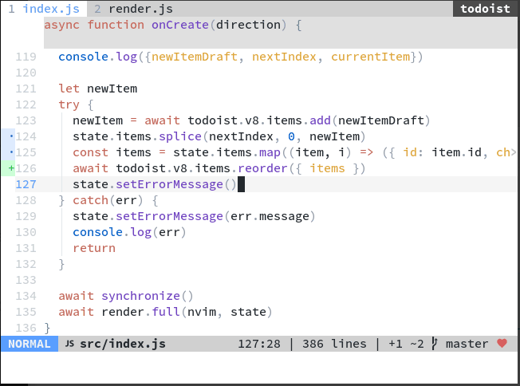
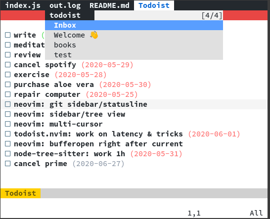

# todoist.nvim

> A hopefully usable todoist extension for neovim



For integration with vim-clap (fuzzy finder) [see below](#integration-with-clap).

#### Install

Find your API key here: https://todoist.com/prefs/integrations

```vim
" NOTE: keep your key in an env var for more safety; you don't want it in your
"       vim config because you'll end up pushing it to github like I did
let todoist = { 'key': $YOUR_API_KEY }


Plug 'romgrk/todoist.vim', { 'do': ':TodoistInstall' }
```

If you don't use [vim-plug](https://github.com/junegunn/vim-plug), run the `TodoistInstall`
command manually to complete the installation.

#### Requirements

 - neovim 0.4.0
 - nodejs 10.0.0
 - `npm install -g neovim@latest` (**NOTE**: needs to be at v4.9.0 at least!)

Make sure your nodejs provider works (`:checkhealth` to confirm).

## Usage

`:Todoist [project_name]` (default: `Inbox`. Creates project if it doesn't exist)

### Mappings

|Keys|Effect|
|---|---|
|`x`|Toggle current task completion|
|`cc`|Change current task text|
|`cd`|Change current task date ([date formats](https://get.todoist.help/hc/en-us/articles/205325931-Due-Dates-Times))|
|`DD`|Delete current task|
|`O`|Add new task before|
|`o`|Add new task after|
|`<`|Unindent|
|`>`|Indent|
|`r`|Refresh|
|`pcc`|Change current project color|
|`pcn`|Change current project name|
|`pdd`|Archive current project *premium users only :/*|
|`pDD`|Delete current project|

### Options

Below are the default options:

```vim
let g:todoist = {
\  'key': v:null,
\  'icons': {
\    'unchecked': ' [ ] ',
\    'checked':   ' [x] ',
\    'loading':   ' […] ',
\    'error':     ' [!] ',
\  },
\  'defaultProject': 'Inbox',
\  'useMarkdownSyntax': v:true,
\}
```

If you have a [NerdFont](https://www.nerdfonts.com/) installed, you can use the icons
below, that will render like in the gif above.

```vim
let todoist = {
\ 'key': $TODOIST_API_KEY,
\ 'icons': {
\   'unchecked': '  ',
\   'checked':   '  ',
\   'loading':   '  ',
\   'error':     '  ',
\ },
\}
```

### Integration with Clap

If you're using [vim-clap](https://github.com/liuchengxu/vim-clap), you can integrate
project selection by adding this to your config files:

```vim
let clap_provider_todoist = {
\ 'source': {-> Todoist__listProjects()},
\ 'sink': 'Todoist',
\}
```


