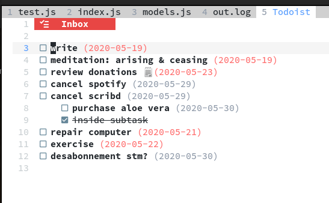

# todoist.vim (neovim only) [WIP]

> A hopefully usable todoist extension for neovim

#### Install

```vim
Plug 'romgrk/todoist.vim', { 'do': 'UpdateRemotePlugins' }
```

You might need to `npm install`, haven't polished the installation process yet.

#### Requirements

 - neovim 0.4.0
 - nodejs 10.0.0
 - a working nodejs provider (`:checkhealth` to confirm)

## Usage

`:TodoistInit`



### Mappings

|Keys|Effect|
|---|---|
|`x`|Toggle current task completion|

## Missing

 - Everything except listing & completing (re-opening is actually broken)

